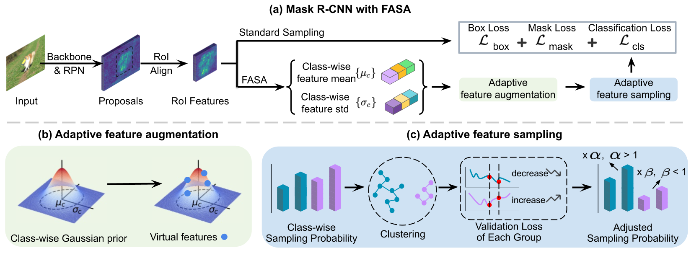

# FASA: Feature Augmentation and Sampling Adaptation for Long-Tailed Instance Segmentation (ICCV 2021)

This repository contains the implementation of the following paper:
> **FASA: Feature Augmentation and Sampling Adaptation for Long-Tailed Instance Segmentation**<br>
> Yuhang Zang,Chen Huang, Chen Change Loy<br>
> International Conference on Computer Vision (**ICCV**), 2021<br>

[[arXiv](https://arxiv.org/abs/2102.12867)]
[[Project Page](https://www.mmlab-ntu.com/project/fasa/index.html)]

<p align="center">
  
</p>

## Running Environment

This code is based on [mmdetection](https://github.com/open-mmlab/mmdetection)==2.14.0 and [mmcv](https://github.com/open-mmlab/mmcv)==1.3.9

### Installation

1. Install [mmdetection](https://github.com/open-mmlab/mmdetection) following the official instruction.
2. Install [COCOAPI](https://github.com/cocodataset/cocoapi).
``` bash
pip install -U 'git+https://github.com/cocodataset/cocoapi.git#subdirectory=PythonAPI'
```
3. Init `data` directory:
``` bash
mkdir data
```
5. Download [LVIS](https://www.lvisdataset.org/) data:
```
|-- data
`-- |-- lvis_v1
    `-- |-- annotations
        |   |-- lvis_v1_train.json
        |   `-- lvis_v1_val.json
        `-- images
            |-- train2017
            |   |-- 000000000009.jpg
            |   |-- 000000000025.jpg
            |   |-- ... 
            `-- val2017
                |-- 000000000139.jpg
                |-- 000000000285.jpg
                |-- ... 
```

### Train
``` bash
./slurm_train.sh <config_file> <work_dir>
```

### Evaluation
``` bash
./slurm_test.sh <config_file> <checkpoint_path>
```

## Results and models of LVIS v1
|    Backbone     |  Lr schd | Sampler | FASA  | mask AP | mask APr | mask APc | mask APf | Config | Download |
| :-------------: | :------: | :-----: |:----: | :-----: | :------: | :------: | :------: | :------: | :--------: |
|    R-50-FPN     | 24e      | Random  | ×     |   18.8  | 1.2      | 16.3     | 29.2     | [config](./configs/mask_rcnn_r50_fpn_mstrain_2x_lvis_v1.py) | [Google Drive](https://drive.google.com/file/d/1pQCccn4jVLDXdCN4ivlR5_8jnFHh9CpZ/view?usp=sharing) |
|    R-50-FPN     | 24e      | Random  | ✓     |   22.2  | 10.5     | 20.4     | 29.4     | [config](./configs/mask_rcnn_r50_fpn_mstrain_2x_lvis_v1_fasa.py) | [Google Drive](https://drive.google.com/file/d/1BhXWg0qvy1shDsUwLQyZzufwIkypbq1Y/view?usp=sharing) |


## Citation
If you find our work useful for your research, please consider citing the paper
```
@inproceedings{zang2021fasa,
  title={FASA: Feature Augmentation and Sampling Adaptation for Long-Tailed Instance Segmentation},
  author={Zang, Yuhang and Huang, Chen and Loy, Chen Change},
  booktitle={Proceedings of the IEEE/CVF International Conference on Computer Vision},
  year={2021}
}
```

## Contact

If you have any questions, please feel free to contact zang0012 AT ntu.edu.sg

## License

This project is open sourced under MIT license.